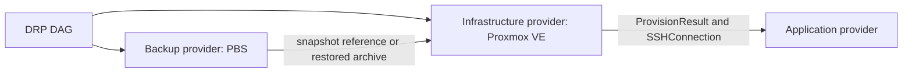

# drtui architecture

## Design constraints

drtui is a stateless orchestrator. A run consumes one immutable `.drp`
execution package, holds transient state in memory, and emits an append-only run
journal to a caller-selected path or stdout. It has no control-plane database,
daemon, or implicit remote state.

The same package, inputs, provider binaries, and external starting state must
produce the same action graph and invocation payloads. External systems can
still change independently, so providers must implement idempotency and report
observed state explicitly.

## Repository layout

Go projects conventionally avoid a top-level `src` directory. Public plugin
contracts therefore live in `pkg`, while engine implementation remains under
`internal`:

```text
drtui/
|-- cmd/drtui/                    CLI entry point only
|-- api/proto/provider/v1/         Versioned out-of-process RPC protocol
|-- internal/
|   |-- app/                       Command composition and dependency wiring
|   |-- package/                   .drp loading, checksums, signatures, lockfile
|   |-- plan/                      YAML parsing, schema and semantic validation
|   |-- engine/                    DAG, scheduler, state context, compensation
|   |-- expression/                Typed ${{ ... }} expression resolution
|   |-- pluginhost/                Discovery, handshake, process and RPC lifecycle
|   |-- journal/                   Redacted JSONL execution events
|   `-- security/                  Trust policy, path checks, log redaction
|-- pkg/pluginapi/                 Stable Go contracts and shared value types
|-- schemas/
|   |-- drp.schema.json            Plan authoring and package validation
|   `-- plugin.schema.json         Provider manifest validation
|-- examples/coolify-s3-cloudflare/
|   `-- plan.drp.yaml              End-to-end reference plan
|-- examples/proxmox-pbs/
|   `-- plan.drp.yaml              Isolated PBS inventory and archive restore
|-- plugins/                       Optional built-in/reference adapters only
|   |-- keyvault/
|   |-- storage/
|   |-- backup/
|   |-- application/
|   |-- infrastructure/
|   `-- dns/
`-- docs/                          Protocol, security, authoring, and ADRs
```

Third-party providers should normally be separate repositories and processes.
This keeps their SDK dependency trees and failures outside the CLI process.

## Execution package

Development plans may be run directly as `plan.drp.yaml`. A release artifact is
an immutable ZIP64 file with a `.drp` extension and this logical layout:

```text
recovery.drp
|-- plan.drp.yaml                  Required declarative plan
|-- plugins.lock.json              Exact source, version, SHA-256 and protocol
|-- package.manifest.json          SHA-256 and size for every member
|-- artifacts/                     Optional non-secret scripts/templates
|-- schemas/                       Optional schemas required by pinned plugins
`-- signatures/manifest.sigstore   Optional package signature bundle
```

Paths are normalized UTF-8 relative paths. Absolute paths, `..`, links, devices,
duplicate normalized names, and archive members exceeding configured size or
compression-ratio limits are rejected. The package must never contain secrets.
The manifest is verified before any provider starts.

The CLI never modifies the package. `--journal <path>` creates a separate
`.drp-run.jsonl` artifact. Journals include package digest, resolved non-secret
inputs, provider digests, transitions, attempt numbers, redacted output hashes,
and rollback results. Secret values and raw provider stdout are never recorded.

## Plan compilation

Compilation happens before side effects:

1. Load and verify the package and lockfile.
2. Parse YAML 1.2 with aliases disabled and resource limits enabled.
3. Convert it to canonical JSON and validate `schemas/drp.schema.json`.
4. Load each pinned provider and validate its config and action inputs against
   the provider-advertised JSON Schemas.
5. Resolve non-secret inputs and statically check expressions and output types.
6. Add expression-derived dependencies and reject undeclared or cyclic edges.
7. Expand static `forEach` arrays in source order; object keys sort by UTF-8.
8. Freeze the DAG and calculate its SHA-256 before executing any step.

An expression must occupy the complete YAML scalar, for example
`${{ steps.provision.outputs.publicIp }}`. String interpolation is intentionally
not supported: whole-value substitution preserves `ip`, `boolean`, object,
list, and secret-reference types. Supported roots are `inputs`, `steps`,
`secrets`, `item`, and the read-only `runtime.workDir`.

Every `steps.<id>` reference must point to a transitive dependency in `needs`.
Step outputs are immutable and can be published only once. Sensitive outputs
are opaque references to mutable in-memory buffers; they cannot participate in
conditions, string conversion, journal payloads, or non-secret outputs.

## DAG and compensation semantics

A step becomes ready only after every `needs` predecessor succeeds. Ready steps
are dispatched in declaration order. `maxParallel: 1` gives strictly sequential
execution; higher values preserve dispatch order but permit independent work.

Step states are:

```text
pending -> ready -> running -> succeeded
                          `-> failed
pending -> blocked | skipped
succeeded -> rolling_back -> rolled_back | rollback_failed
```

`transaction.rollback: on-failure` is a compensating transaction, not an ACID
transaction. If a member fails, the engine stops dispatching that transaction
and invokes rollback handlers for its successful members in reverse topological
order. Rollback inputs are resolved and snapshotted immediately after the
forward step succeeds. A rollback failure is journaled and does not prevent
remaining compensations. The process exits non-zero if either forward execution
or any compensation fails.

Providers receive a deterministic idempotency key derived from package digest,
step instance ID, action, and attempt. Provider actions must be safe to retry
with that key. Random retry jitter is disallowed; fixed exponential backoff is
allowed because it does not alter action payloads or ordering.

## Provider model

The exact in-process contracts are defined in
[`pkg/pluginapi/providers.go`](../pkg/pluginapi/providers.go). All calls take a
`context.Context`, return explicit Go errors, and use semantic types such as
`netip.Addr`, `StorageURI`, and `DomainName`. Arbitrary provider configuration is
the sole dynamic boundary: it is canonical JSON in `RawConfig`, validated
against the plugin schema before invocation, then decoded by the provider with
unknown fields rejected.

`IBackupProvider`, `IInfrastructureProvider`, and
`IApplicationLayerProvider` are separate. A backup provider resolves and
restores immutable backup snapshots; Terraform or Proxmox VE provisions compute;
Coolify, Heroku, or systemd configures application runtimes. A plugin executable
may advertise multiple capabilities and implement multiple interfaces.

### Proxmox layering

Proxmox Backup Server and Proxmox VE have different ownership boundaries and
must not be represented by one provider:



The PBS implementation in `plugins/proxmoxpbs` wraps
`proxmox-backup-client`. Its core actions are `probeRepository`,
`listSnapshots`, `listSnapshotFiles`, and `restoreArchive`. The CLI is invoked
without a shell, requests JSON output, receives its API token through
`PBS_PASSWORD_FD=0`, and requires a pinned `PBS_FINGERPRINT`. Restore targets
are confined below the provider work directory.

PBS does not create a VM. Restoring an entire PVE guest should be a Proxmox VE
infrastructure action, such as `restoreVM`, which accepts a typed PBS snapshot
reference and delegates to the PVE storage integration or `qmrestore`. File,
configuration, and image archives that must feed another provider can instead
flow through `pbs/restoreArchive` into an engine-owned work path. This keeps
backup selection independently testable from VM allocation and application
bootstrap.

The TypeScript-like `Promise<Record<string,string>>` keyvault contract is
intentionally represented as `(*SecretSet, error)`, not `map[string]string`.
Go strings cannot be wiped. `SecretSet` owns mutable byte buffers, returns
copies, and is destroyed as soon as the final consumer completes. This is
best-effort memory hygiene because the Go runtime cannot guarantee that every
compiler or kernel copy is erased.

### Out-of-process plugins

Production plugins are executables, never Go shared objects. Go's native
`plugin` ABI is toolchain-sensitive and is not supported on Windows. The host
launches a pinned executable and negotiates a versioned protobuf/gRPC protocol:

1. The process receives a one-time handshake token over an inherited pipe.
2. `GetMetadata` returns protocol version, capabilities, action descriptors,
   and input/output JSON Schemas.
3. The host selects a compatible protocol and creates capability-specific
   adapters implementing the Go interfaces.
4. Calls carry deadline, cancellation, idempotency key, and canonical JSON.
5. `Close` drains requests and terminates the child process.

Core actions map directly to the public interfaces. Provider-specific actions,
such as `coolify/injectEnvironment`, use the same RPC envelope and must publish
strict input/output schemas in the plugin manifest. They do not expand the core
Go API. Unknown actions, capabilities, fields, or output types fail compilation.

Provider config is validated at compile time but resolved immediately before an
action invokes that provider. A step-output expression in config adds an
implicit edge from the producing step to every use of that provider, and each
use must already have that producer as a transitive `needs` dependency. This
allows a credential handle fetched early in the DAG to initialize Cloudflare
without storing the credential in the package or starting the provider early.

Provider executables are selected only from `plugins.lock.json`; plan `source`
and `version` are human-reviewable assertions. Release mode requires a SHA-256
match and optionally Sigstore identity policy. The host sends each provider only
the secret handles and filesystem paths required by that action.

## Failure contract

Providers return structured errors with a stable code, safe message, retryable
flag, and redacted details. Stable codes include `INVALID_CONFIG`,
`AUTHENTICATION_FAILED`, `NOT_FOUND`, `CONFLICT`, `TRANSIENT`, `TIMEOUT`, and
`INTERNAL`. The engine retries only errors marked retryable and only within the
step policy. Panics, protocol violations, invalid output, process exits, and
deadline overruns are non-retryable unless the action descriptor explicitly
declares otherwise.

## Security boundaries

- Host-key pinning is mandatory for SSH; accepting an unknown key is not a plan
  option.
- Providers receive scoped working directories, not the package root.
- Logs use structured fields and redact values by provenance, not regex alone.
- DNS rollback records are captured before cutover or supplied as typed inputs.
- Database verification queries are read-only and time-bounded.
- Shell actions are not a core primitive. Provider-specific remote commands use
  argument arrays and explicit environment maps, never shell-concatenated text.
- Package and plugin signatures establish provenance; digest pinning establishes
  immutability. Production policy should require both.